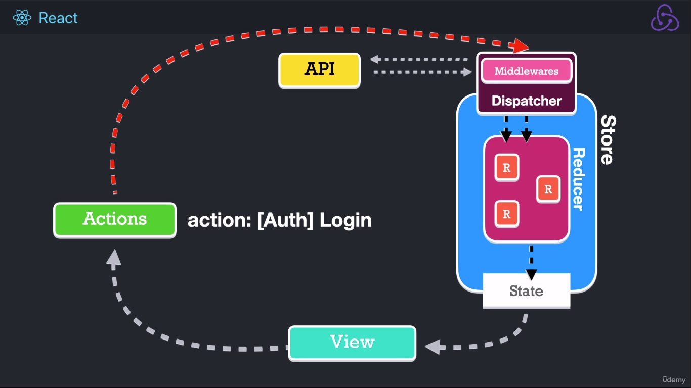

# Redux

1. [Definiciones](#section-1)

[Home]

## Definiciones

- **Redux**:
Contenedor **predecible** del estado de nuestra aplicación.
- **Store**:
Fuente única de la verdad. Es donde está la **información** que mis componentes consumirán.
- **Middlewares**:
Para tareas **asíncronas**.
- **Dispatch**:
Dispone que **reducer** hará la tarea.
- **Actions**.
- **State**.
- **Acciones asíncronas**.

[Home] - [Top]

[Top]: 			#header
[Home]: 		../README.md
